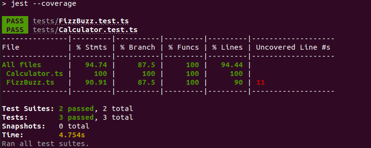

# TypeScript Writing Unit Tests in VSCode

Escrevendo testes com [Jest](https://jestjs.io/) e debugando no [VSCode](https://code.visualstudio.com/).

Você pode abrir qualquer arquivo de teste e acionar `F5` ou executar a configuração `Jest Current File`.

Ou, apenas, exeutar no terminal...

    npm t
    npm run test
    npm run coverage

